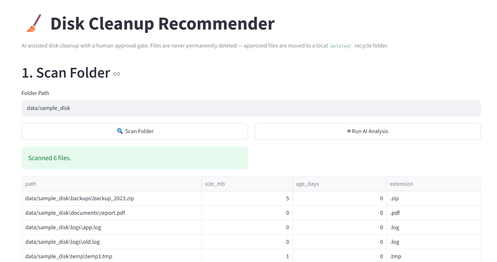
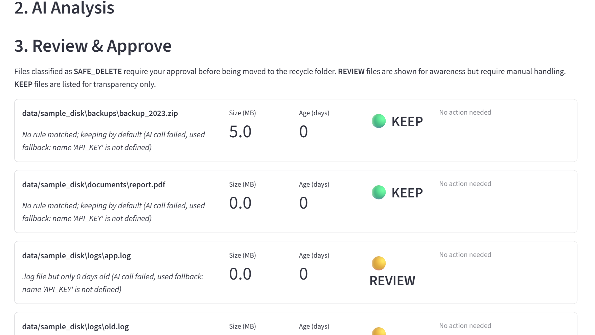
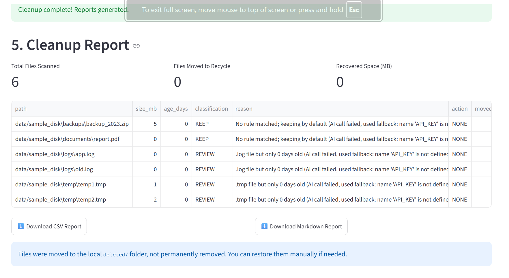

📌 Problem Statement

Modern computers accumulate temporary, duplicate, obsolete, and unused files over time, leading to wasted storage space and reduced system efficiency. Manually identifying files that can be safely removed is time-consuming and risky. This project uses AI-assisted analysis and safety rules to recommend files for cleanup while ensuring the user remains in complete control of every deletion decision.

---

👥 Team Members

Name| Role
G.Varshitha| Developer
G.Vyshnavi| AI Integration
G.Harshitha| UI & Testing
G.Gouri| Documentation & Reporting

---

🚀 Features Implemented

- Folder scanning and file discovery
- AI-powered file classification
- File categorization into:
  - KEEP
  - REVIEW
  - SAFE_DELETE
- Human approval before cleanup
- Rule-based safety validation
- Safe file movement instead of permanent deletion
- Cleanup report generation
- Streamlit-based user interface
- Optional Discord approval bot integration
- Offline mode support without AI API

---

🧠 How It Works

Scan Folder
    ↓
Read Files
    ↓
AI Analysis (Gemini)
    ↓
Safety Validation Rules
    ↓
User Review & Approval
    ↓
Move Files to Safe Deleted Folder
    ↓
Generate Cleanup Report

---

🏗️ Architecture Overview

 

The system follows a modular architecture where each component performs a dedicated responsibility. AI recommendations are always verified by safety rules and require user approval before any cleanup action is performed.

---

📁 Project Structure

---

🧰 Tools and Technologies Used

Category| Technology
Programming Language| Python
User Interface| Streamlit
AI Model| Gemini AI
File Processing| Python OS Libraries
Reporting| CSV, Markdown
Testing| PyTest
Optional Notifications| Discord Bot
Version Control| Git & GitHub

---

⚙️ Setup Instructions

1. Clone the Repository

   https://github.com/VarshithaCodes/Disk_Cleanup_Recommender-
   
3. Install Dependencies

pip install -r requirements.txt

3. Configure Gemini API (Optional)

Linux / Mac:

export GEMINI_API_KEY="your-api-key"

Windows:

set GEMINI_API_KEY=your-api-key

If no API key is provided, the application runs in offline rule-based mode.

---

▶️ Run Instructions

Start the application:

streamlit run app.py

Usage Steps

1. Open the Streamlit interface.
2. Select a folder to analyze.
3. Click Scan Folder.
4. Run AI analysis.
5. Review recommendations.
6. Approve cleanup actions.
7. View generated reports.

---

📝 Sample Input

┌─────────────────────────┐
│       sample_disk/      │
│ ├─ old_log.txt          │
│ ├─ cache.tmp            │
│ ├─ temp_backup.zip      │
│ ├─ project_report.pdf   │
│ └─ notes.docx           │
└─────────────┬───────────┘
              │
              ▼
┌─────────────────────────┐
│      Folder Scanner     │
└─────────────┬───────────┘
              │
              ▼
┌─────────────────────────┐
│      AI Classifier      │
└─────────────┬───────────┘
              │
              ▼
┌─────────────────────────┐
│    Safety Validator     │
└─────────────┬───────────┘
              │
              ▼
┌─────────────────────────┐
│      User Approval      │
└───────┬─────────┬───────┘
        │         │
        ▼         ▼
┌─────────────┐ ┌─────────────┐
│ Safe Mover  │ │   Report    │
│             │ │ Generator   │
└──────┬──────┘ └──────┬──────┘
       │               │
       ▼               ▼
┌─────────────┐ ┌─────────────┐
│  deleted/   │ │  outputs/   │
└─────────────┘ └─────────────┘
---

📤 Sample Output

File Name| AI Decision| Action
old_log.txt| SAFE_DELETE| Moved to deleted/
cache.tmp| SAFE_DELETE| Moved to deleted/
temp_backup.zip| REVIEW| User Verification Required
project_report.pdf| KEEP| No Action
notes.docx| KEEP| No Action

Generated Reports:

outputs/cleanup_report.csv
outputs/cleanup_report.md

---

🤖 AI Capability Demonstrated

This project demonstrates the practical application of Generative AI for intelligent disk cleanup assistance.

AI Features

- Intelligent file classification
- Context-aware cleanup recommendations
- Risk-based decision making
- Explainable AI reasoning
- Human-in-the-loop approval workflow
- Smart identification of potentially removable files

Example AI Analysis

File: old_log.txt

Reason:
This file appears to contain historical log data and has not been modified recently.

Decision:
SAFE_DELETE

The AI never directly deletes files. It only provides recommendations, while the user makes the final decision.

---

🛡️ Safety Measures

- Important files are never deleted automatically.
- Protected file types include:
  - .exe
  - .pdf
  - .docx
  - .db
  - .dll
  - .sys
- User approval is mandatory.
- Files are moved to a safe deleted folder.
- System directories are protected.
- Safety validation runs before every cleanup action.

---

📊 Output Reports

After execution, the system generates:

outputs/cleanup_report.csv
outputs/cleanup_report.md

Reports include:

- File name
- File path
- AI decision
- Safety status
- Cleanup action taken
- Timestamp

---

🧪 Testing

Run unit tests:

pytest tests/

Expected output:

========================
All tests passed
========================

---

⚠️ Assumptions and Limitations

Assumptions

- Users have permission to access selected folders.
- Gemini API is available when AI mode is enabled.
- File extensions provide useful classification clues.
- Users review recommendations before approval.

Limitations

- AI recommendations may occasionally require manual verification.
- Some binary file formats may have limited content analysis.
- Large directories may increase processing time.
- Offline mode provides reduced classification accuracy.
- The application does not permanently remove files.

---

💡 AI Innovation

Unlike traditional cleanup tools that rely only on fixed rules, this system combines:

- Generative AI reasoning
- Rule-based safety checks
- Human approval workflows

This hybrid approach improves accuracy while maintaining user control and safety.

---

🎥 Demo Video

Project Demo Video:

https://drive.google.com/file/d/1n_q-XZE8qYq5JkJukIOLQjJI1HKYnX72/view?usp=drivesdk

---

📌 Future Enhancements

- Duplicate file detection
- Storage usage visualization
- Scheduled cleanup recommendations
- Cloud backup before cleanup
- Multi-user approval workflows
- Advanced file similarity analysis

An AI-powered assistant that helps users safely identify and clean unnecessary files while ensuring complete user control over every cleanup action.
